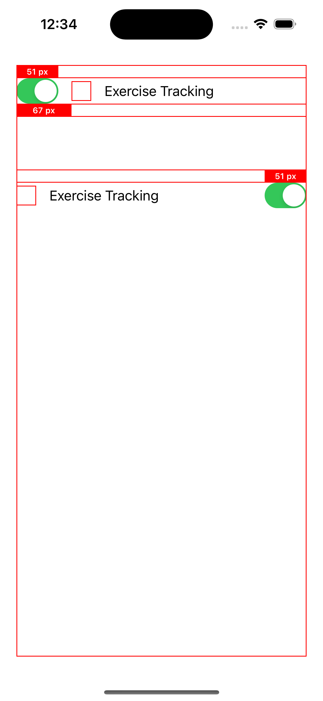

#  UISwitch Invalid `intrinsicContentSize` w/ AutoLayout

## Summary
`UISwitch`'s intrinsic content size (`UISwitch.intrinsicContentSize`) is `(49.0, 31.0)`, but the actual size is `(51.0, 31.0)`.
This makes some auto layout issue, for example, UISwitch and views with same trailing space to superview are not trailing alignment (as shown in attached screenshots).

Expected Results:
`UISwitch.intrinsicContentSize == (51.0, 31.0)`

Actual Results:
`UISwitch.intrinsicContentSize == (49.0, 31.0)`

I tried adjusting content hugging and compression resistance as described [here](https://useyourloaf.com/blog/stack-view-changes-in-ios-15/) and [here](https://useyourloaf.com/assets/docs/Modern%20Auto%20Layout%20Preview.pdf), but could not achieve the desired result.

## Related Radars
* [rdar://31777116](https://openradar.appspot.com/31777116)
* [rdar://50930708](https://openradar.appspot.com/50930708)

## Screenshots

*Note:* `67px = 51px (UISwitch width) + 16px (spacing)` 

### Misaligned and clipped using `UISwitch`

### (A) Solution: Aligned and *not-clipped* using custom `UISwitch`

~~~~swift

class Switch: UISwitch {
    
    override var intrinsicContentSize: CGSize {
        bounds.size
    }
    
}

~~~~

## Alternatives
~~~~swift

switch.snp.makeConstraints { make in
    make.width.equalTo(51)
}

~~~~
